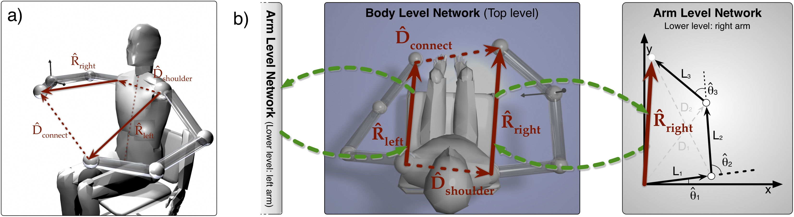

# Hierarchical Dual-Quaternion Mean of Multiple Computation Neural Network

Implementation of a hierarchical internal body model that is based on the Mean of Multiple Computation principle in Python.  The body model is realized as a recurrent neural network and is based on dual quaternion representation.

This repository provides an implementation for the article Schilling, M. (submitted), Hierarchical Dual Quaternion-Based Recurrent Neural Network as a Flexible Internal Body Model. 

Detailed information and visualization on MMC equations and posture variations for the experiments can be found in the [supplemental material](schilling2018mmc_supplement.pdf).

--
### Summary

A hierarchical Mean of Multiple Computation neural network is presented that is based on an axis-angle representation of joint movements using dual quaternions. It is shown in detail how the network provides a solution for the forward kinematic problem applied for the case of a seven degrees of freedom robot manipulator. Furthermore, it is used in a complex scenario of a bimanual movement task. This demonstrates how the MMC approach can be easily scaled up from a representation of a single arm to a complex model of a complete body.

This hierarchical MMC approach can deal with complex robotic structures by distributing the complexity onto different levels of a hierarchy. There are lower levels which explicitly deal with detailed kinematic representation, e.g., the joint level and the individual segments of an arm as described before. On a higher level, the lower level modules are only represented in an abstracted way. As an example, we extend our model of a single arm towards a body model consisting of two arms. For such a model of two arms attached to a torso, the higher level model only comprises vectors towards the end point of the arms. The movements of both arms can now be coordinated on this higher level: they are connected through two transformations in this body network. First, the fixed relationship between the two shoulders is represented as a translation expressed as a dual quaternion. Further transformations could be introduced to represent the upper body, legs and other body parts. 

Here, we are using a simple setup for a bimanual task. 

- on the lower level: two three segmented arms (like a human arm) are used in the following. There are three joints and overall seven DoFs. For the first and third joint (the shoulder and the hand joint) there are three DoFs. The second joint (the elbow) is restricted to one degree of freedom. This means, for this joint the joint axis is fixed, while for the other two joints the axis describing the rotation can be freely chosen. The kinematic chain of the whole arm can now be described as a concatenation of the joint rotations and translations along the segments. These transformations are expressed as dual quaternions and a dual-quaternion based recurrent neural network represents the kinematics of each arm (see [Schilling, 2011](https://link.springer.com/article/10.1007/s10514-011-9226-3) for details). 
- on the higher-level: The two arms are represented by the end effector positions. Furthermore, the relation between the two end effectors is expressed as one connecting translation. Overall, this higher level of the body model can be expressed as one simple equation describing the closed chain of transformation.

--
### Requirements

The scripts are in python and we used python 2.7. Pickle is used to save data from training runs and matplotlib for visualizing the data.

--
### Content

The repository consists of two different sets of simulation. 

* 1\_SingleArm\_DQ\_ForwardKinematic - test convergence of a dual-quaternion based Mean of Multiple Computation network
in a series of forward kinematic tasks for a three segmented arm (7 DoFs). The arm is moved on the joint level from 729 starting postures towards two different target postures. The prediction of the end position is tracked and compared to the real value of the end position (for the given joint configuration). Overall, the internal model using dual quaternion representation nicely followed the movement and provided a good estimate of the target position.
* 2\_HierarchicalMMC\_BimanualTask - Simulation of the Hierarchical Dual-Quaternion-based MMC network as a body model.
The task is a bimanual task - one arm is driven on the joint level (forward kinematics) and the other arm is expected to follow this movement (inverse kinematic task) - both arms should touch each other at the end effectors. The model is moved through all postures from above that are reachable to both arms (561 postures). Result is a plot showing distance between the end effectors of the left and right arm over time.
Distance increased during the movement up to 0.113 units, but this difference is not very large as overall the mean distance between starting point and target point was 
2.021 (S.D. 0.672) units.

--
### MMC approach

One example for an internal body model is realized by a Mean of Multiple Computations network (see [Schilling, 2011](https://link.springer.com/article/10.1007/s10514-011-9226-3) for example). The general structure of the neural network is not learned, but setup following the MMC principle. The model encodes geometric and kinematic constraints in a recurrent neural network. This shapes an attractor space that represents valid configurations of the manipulator structure. Importantly, diverse tasks can be given to the network which initially act as a disturbance on a previous state of the network, but which are resolved through spreading the disturbance through the network and settling in a new valid state. For example, an inverse kinematic problem can be solved by injecting a new position for the end effector into the network which requires the individual segments of the controlled structure to adapt towards new positions.

The Mean of Multiple Computation principle consists of two key ideas: first, the overall complexity of the controlled structure is broken down. As an example, we will use a three-segmented robotic arm. When the whole kinematic chain is expressed as one single equation, the problem becomes quite difficult for traditional control approaches. In the inverse kinematic task there are multiple possible configurations in order to reach a certain target position. Instead, the MMC principle breaks this down into multiple computations that consist of local relationships between variables. While the individual equations become trivial to solve (they only consist of three variables), we end up with multiple of such computations. As the second key idea, the MMC principle exploits this redundancy. As each variable appears in multiple computations, it depends on multiple of these equations. The MMC network works in an iterative fashion: an update for a variable is calculated using all the equations that affect this variable. The different multiple computations are integrated towards a new value - this is realized as a simple weighted mean calculation.

Here, a hierarchical Mean of Multiple Computation neural network is realized in Python. On the lower-level, detailed limb kinematics are represented that are based on an axis-angle representation of joint movements using dual quaternions. It is shown in detail how the network provides a solution for the forward kinematic problem applied for the case of a seven degrees of freedom robot manipulator. Furthermore, this is used in a hierarchical model in a complex scenario of a bimanual movement task. This demonstrates how the MMC approach can be easily scaled up from a representation of a single arm to a complex model of a complete body.
